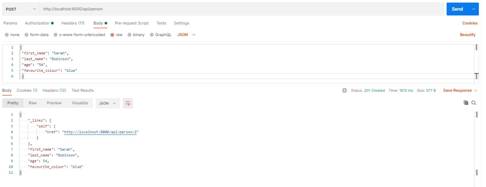
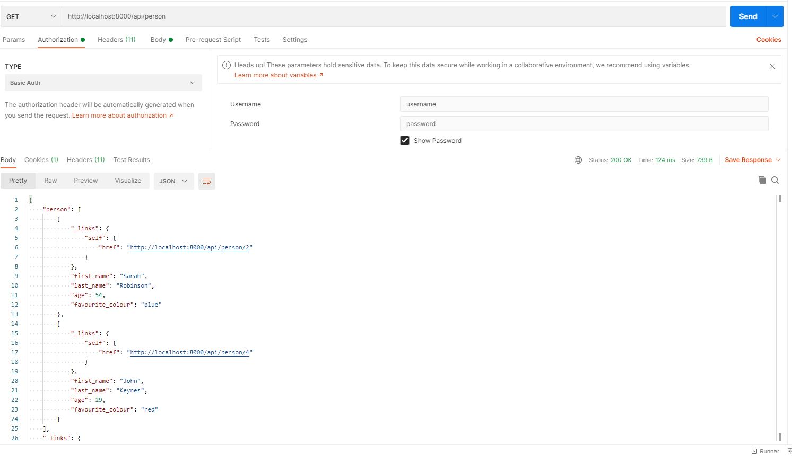
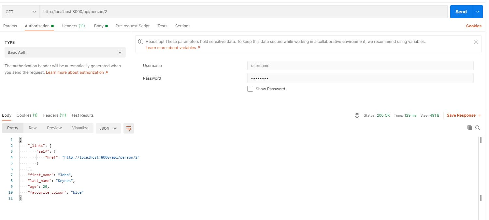
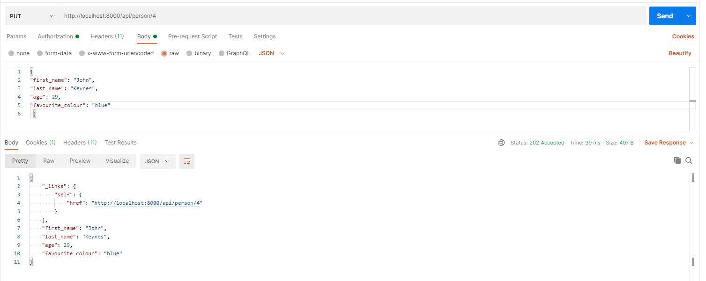
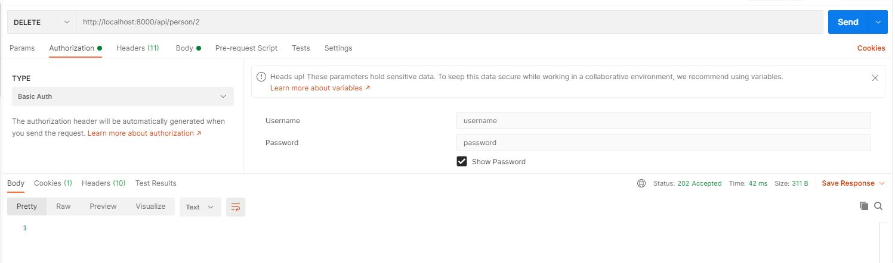

# This is the solution for problem statement 1 mentioned for test EBI01705

---
### Table of Contents
- [Description](#description)
- [How To Build](#how-to-build)
- [How To Deploy](#how-to-deploy)
- [How To Run](#how-to-run)
- [Web Service Documentation](#web-service-documentation)
- [Important Notes](#important-notes)
- [About the Service](#about-the-Service)

## Description

This project is build in Java ( version 11 ) / Spring boot ( version 2.2.6.RELEASE ) / Gradle. The Application is package as a jar file using embedded tomcat.

* RESTful Web services is created with Spring MVC ( org.springframework.boot:spring-boot-starter-web ).
* RESTful HATEOS is created with Spring HATEOS ( org.springframework.boot:spring-boot-starter-hateoas ).
* In Memory Databse integration is done using JPA api ( com.h2database:h2 / org.springframework.boot:spring-boot-starter-data-jpa ).
* Java bean validation is done using javax.validation .
* Web Security is achieved using Spring Security ( org.springframework.boot:spring-boot-starter-security ).
* Testing is done using JUnit5 and Spring boot Test api ( org.junit.jupiter / org.springframework.boot:spring-boot-starter-test ).
* REST Documentation is done using REST docs ans AsciiDocs ( org.springframework.restdocs:spring-restdocs-asciidoctor / org.springframework.restdocs:spring-restdocs-mockmvc ).
* Docker image generation is done with com.palantir.docker.

## How To Build

One of the way to run this project to build using gradle command

```shell
gradle clean build
```

## How To Deploy

There are two way to do deploy the application
* Create Docker image locally
	
```shell
gradle clean build docker
```
	
* Pull image from Dockerhub
	
```shell
docker pull pankajmandavkar07/solution1:1.0.1.RELEASE
```

## How To Run

There are two way to do deploy the application
* Can run directly with java pre installed
	
```shell
gradle clean build
java -jar ./build/libs/solution1-1.0.1-RELEASE.jar
```
	
* Run docker image. for this approach, need to have docker install in local
	
```shell
docker run --ip localhost -p 8000:8000 pankajmandavkar07/solution1:1.0.1-RELEASE
```

## Web Service Documentation

Documentation for this application is available at folder ./documentation/index.html
Also, this can be generated by below command

```shell
gradle clean build asciidoctor
```
## Important Notes

* H2 DB Creds
console url: http://localhost:8000/api/h2-console/
JDBC URL: jdbc:h2:mem:testdb
username: sa
password: password

* Web Security Creds
username: username
password: password

* Basic Auth
Basic dXNlcm5hbWU6cGFzc3dvcmQ=

## About the Service

* Add New Person

[](documentation/images/Post.JPG)

* Get All Person

[](documentation/images/Get.JPG)

* Get All Person using Pagination

[](documentation/images/Get_with_page.JPG)

* Get Person by id

[](documentation/images/Get_with_id.JPG)

* Update Person

[](documentation/images/Put.JPG)

* Delete Person

[](documentation/images/delete.JPG)
